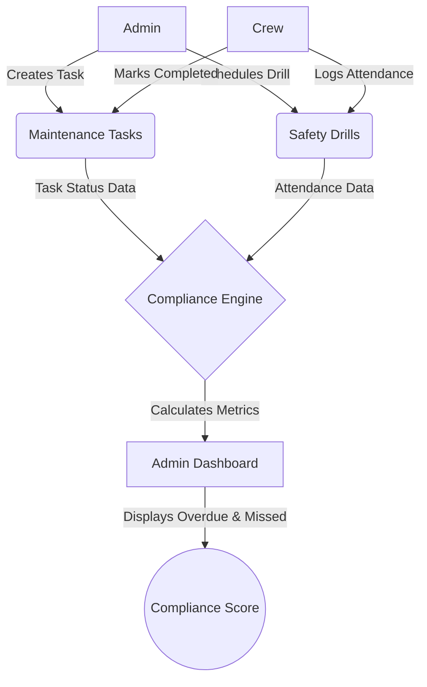

# Fathom Maritime Operations Platform
## Business Flow Document

The Fathom Maritime Operations Platform is designed to ensure ships remain operationally safe and compliant with maritime regulations. The system primarily focuses on two areas:
1. **Ship Maintenance**
2. **Safety Drills**

This document outlines the core business flow of how administrators and crew members interact with the platform.

### User Roles

- **Admin**: Oversees multiple ships, creates tasks, schedules drills, and monitors compliance.
- **Crew**: Assigned to specific ships, responsible for executing tasks, and participating in drills.

---

### Core Workflows

#### 1. Maintenance Management Flow
1. **Creation**: An Admin identifies a maintenance need on a specific ship and creates a **Maintenance Task** (e.g., "Inspect Engine Valve") with a designated Due Date.
2. **Assignment**: The task is assigned to the Crew on that ship and its status is set to `Pending`.
3. **Execution**: Crew members view their assigned tasks on their dashboard. As they begin work, they update the status to `In Progress`.
4. **Completion**: Once finished, the Crew updates the status to `Completed` and can optionally append notes.
5. **Non-Compliance Risk**: If the Due Date passes and the status is not `Completed`, the task is flagged as **Overdue**, negatively impacting the ship's compliance score.

#### 2. Safety Drill Workflow
1. **Scheduling**: An Admin schedules a **Safety Drill** (e.g., "Fire Evacuation Drill") for a specific ship on a future date.
2. **Notification**: The upcoming drill appears on the Crew's dashboard.
3. **Participation**: During the scheduled date, Crew members execute the drill and mark their attendance in the system.
4. **Verification**: The system logs the attendance.
5. **Non-Compliance Risk**: If the drill date passes without sufficient attendance/completion, it is marked as **Missed**, which severely impacts the compliance score.

#### 3. Compliance Engine
The system does not store a static "score" in the database. Instead, the Compliance Engine calculates it dynamically:
- It aggregates all `MaintenanceTasks` and `SafetyDrills`.
- It calculates the percentage of completed tasks versus total tasks.
- It calculates the attendance percentage of drills.
- **Result**: The Admin Dashboard displays a real-time compliance score and highlights high-risk areas (Overdue tasks, Missed drills) for immediate action.

---

### Process Diagram

