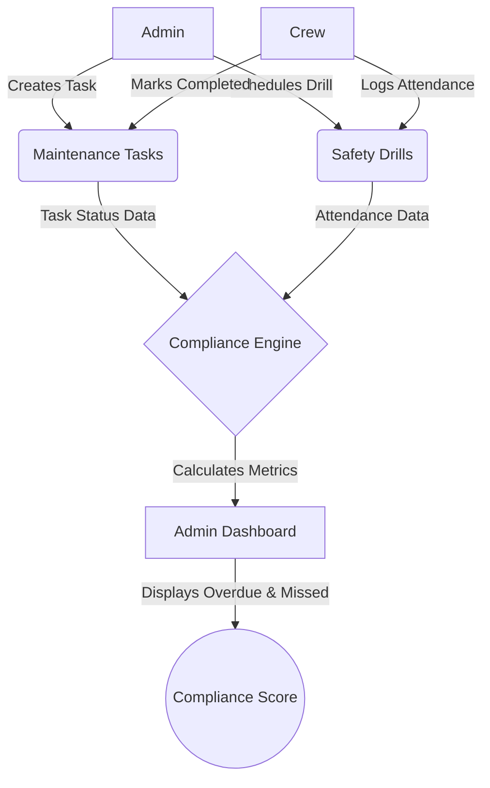

# Fathom Maritime Operations Platform

A full-stack maritime operations and compliance platform built to streamline ship maintenance and safety drill tracking.

## Live Demo & Credentials

The application is fully deployed and can be tested here:
**URL:** [https://fathom-frontend.onrender.com/](https://fathom-frontend.onrender.com/)

**Admin Credentials:**
- Email: `admin@gmail.com`
- Password: `Techash11@`

**Crew Credentials:**
- Email: `testcrew@gmail.com`
- Password: `testcrew11@`

## Architecture Decisions

When designing the Fathom platform, I made several deliberate architectural choices to ensure scalability, performance, and maintainability:

1. **Go + Fiber Backend**: I chose Fiber because of its Express-like routing, zero memory allocation optimizations, and blazing-fast performance. It allows us to build an extremely performant API that handles high concurrency gracefully.
2. **Derived Compliance (Service Layer)**: Rather than storing compliance scores in the database (which leads to stale data and complex synchronization logic), I calculate compliance on-the-fly in the `ComplianceService`. By aggregating data directly from the `MaintenanceTasks` and `SafetyDrills` tables, the compliance metrics are always 100% accurate and real-time.
3. **Handler/Service/Repository Pattern**: 
   - **Handlers**: Manage HTTP requests, parameter parsing, and responses.
   - **Services**: House the core business logic (e.g., detecting overdue tasks, calculating percentages).
   - **Models**: Defines the database schema and GORM logic.
   This decoupled approach ensures our business logic is fully isolated from the HTTP transport layer, making it highly testable and extensible.
4. **React + Tailwind CSS**: Built with Vite and TanStack Query to ensure ultra-fast client-side state synchronization with the backend, styled with a custom marine-themed Tailwind configuration.

## Business Flow

Below is the core business flow diagram illustrating how Administrators and Crew interact with the system to maintain compliance.



## Setup & Running Locally

1. **Clone the repository:**
   ```bash
   git clone https://github.com/ashmitsharp/fathom.git
   cd fathom
   ```

2. **Start the full stack with Docker Compose:**
   The entire infrastructure (PostgreSQL, Go Backend, React Frontend) is fully containerized.
   ```bash
   docker-compose up --build
   ```

3. **Access the application:**
   - **Frontend**: http://localhost:3005
   - **Backend API**: http://localhost:8080

*(Note: The database runs on port 5432 and persists data to a local Docker volume `postgres_data`).*

## API Reference

### Authentication
- `POST /api/auth/register`: Register a new user (Crew/Admin).
- `POST /api/auth/login`: Authenticate and receive a JWT.

### Ships (Admin)
- `GET /api/ships`: List all ships.
- `POST /api/ships`: Add a new ship.

### Maintenance Tasks
- `GET /api/tasks`: Get tasks (Supports `?ship_id=`, `?status=`, `?date=` filters).
- `POST /api/tasks`: Create a new task (Admin).
- `PATCH /api/tasks/:id/status`: Update task status (Crew).
- `POST /api/tasks/:id/notes`: Append notes to a task (Crew).

### Safety Drills
- `GET /api/drills`: Get scheduled drills.
- `POST /api/drills`: Schedule a new drill (Admin).
- `POST /api/drills/:id/attend`: Mark attendance (Crew).

### Compliance
- `GET /api/compliance/summary`: Get aggregated compliance metrics for all ships (Admin).
- `GET /api/compliance?ship_id=`: Get metrics for a specific ship.
